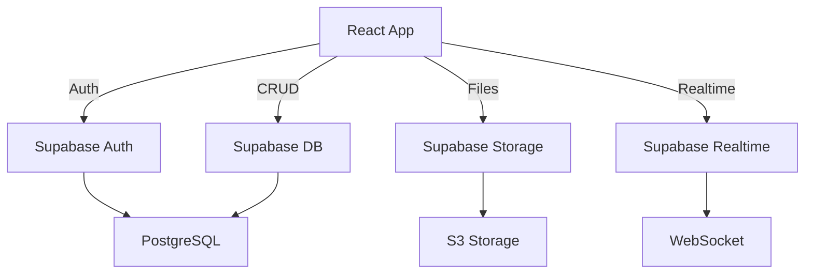

# Architecture de l'application

## Stack Technique

### Frontend
- **React 18** - Framework UI
- **Tailwind CSS** - Styling
- **React Calendar** - Composant calendrier
- **date-fns** - Manipulation des dates
- **Supabase JS Client** - SDK client

### Backend
- **Supabase** - Backend as a Service
  - PostgreSQL - Base de données
  - Auth - Authentification
  - Storage - Stockage de fichiers
  - Realtime - Synchronisation temps réel
  - Edge Functions - Logique métier

### Infrastructure
- **Vercel** - Hébergement frontend
- **GitHub** - Gestion du code source
- **GitHub Actions** - CI/CD

## Structure du projet

```
cogc-planning-dev/
├── public/
│   ├── index.html
│   ├── manifest.json
│   └── favicon.ico
├── src/
│   ├── components/
│   │   ├── Calendar.js
│   │   ├── AuthForm.js
│   │   ├── Dashboard.js
│   │   ├── PlanningView.js
│   │   └── UserProfile.js
│   ├── services/
│   │   ├── authService.js
│   │   ├── planningService.js
│   │   └── userService.js
│   ├── lib/
│   │   └── supabaseClient.js
│   ├── hooks/
│   │   ├── useAuth.js
│   │   └── useSupabase.js
│   ├── utils/
│   │   ├── dateHelpers.js
│   │   └── validation.js
│   ├── App.js
│   ├── App.css
│   ├── index.js
│   └── index.css
├── docs/
│   ├── API.md
│   ├── ARCHITECTURE.md
│   ├── DATABASE.md
│   └── FEATURES.md
├── __tests__/
│   └── App.test.js
├── .env.example
├── .gitignore
├── package.json
└── README.md
```

## Flux de données



## Patterns utilisés

### 1. Service Layer Pattern
Séparation de la logique métier dans des services dédiés.

### 2. Custom Hooks
Réutilisation de la logique avec des hooks React personnalisés.

### 3. Row Level Security (RLS)
Sécurité au niveau de la base de données avec Supabase.

### 4. Optimistic UI
Mise à jour immédiate de l'interface avec rollback en cas d'erreur.

## Sécurité

- Authentification JWT via Supabase Auth
- RLS (Row Level Security) sur toutes les tables
- Validation côté client et serveur
- HTTPS obligatoire en production
- Variables d'environnement pour les secrets
- Rate limiting sur les API

## Performance

- Code splitting avec React.lazy()
- Mise en cache des requêtes avec React Query
- Images optimisées et lazy loading
- Bundle minifié en production
- CDN pour les assets statiques

## Monitoring

- Web Vitals pour les métriques de performance
- Sentry pour le tracking d'erreurs
- Google Analytics pour l'usage
- Supabase Dashboard pour les métriques DB